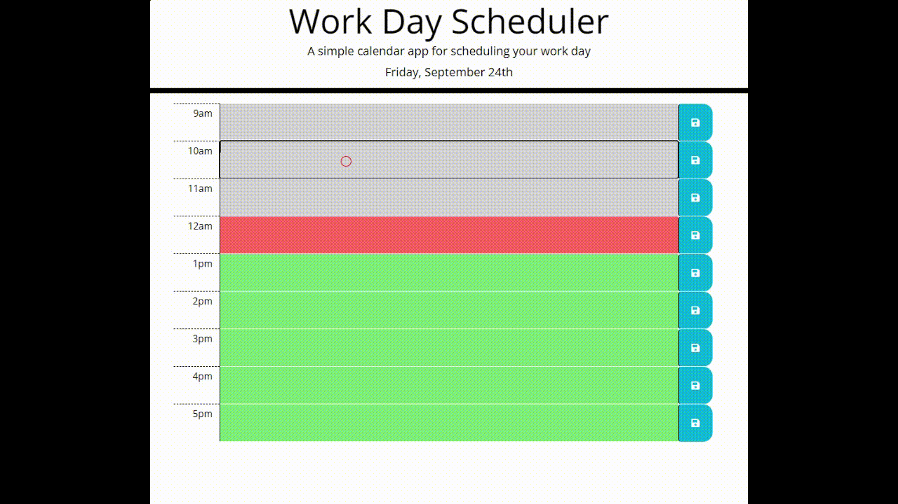

# Work Day Scheduler
## Site Description
This website lets you input events for each hour of the workday. Once you save an event, it's stored locally and remains on the page, even if you refresh. The hours are color coded based on current time of day. The design uses Bootstrap for responsiveness.
## Mock-up
The animation below shows the dynamic functionality.

## Deployed Application

[Schedule your work day!](https://brouiller.github.io/workday-scheduler/)
